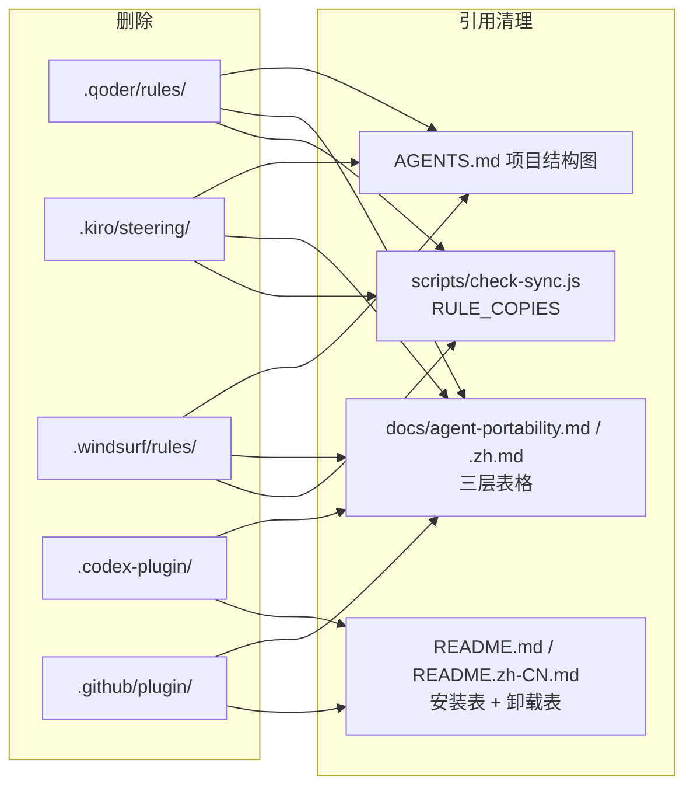

# Design Document

## Overview

纯删减型模块：移除五个适配物及其在 check-sync、README（EN/zh）、portability（EN/zh）、AGENTS.md 结构图中的全部引用。不改任何 canonical 源，不动保留项。

## Architecture

删除面与引用面的对应关系：

## Key Decisions

### Decision 1: 删文件不删能力——文档保留通用复制路径

**Context:** Windsurf/Kiro/Qoder 等宿主只是不再"官方维护适配文件"，用户仍可自行复制 ruleset。

**Options Considered:**
- **Option A: 只删文件** — Pros: 最小改动 / Cons: 这些宿主的用户失去自助路径
- **Option B: 文档保留一句通用说明（复制 `rules/specs-workflow.md` 正文进宿主规则文件）** — Pros: 能力不丢 / Cons: 无

**Decision:** Option B。

**Rationale:** 一句话成本，避免"删适配 = 断支持"的误读。

### Decision 2: `specs-reminder.js` 保留 Codex 输出分支

**Context:** Codex 插件 manifest 移除后，`PLUGIN_DATA` 检测分支在仓库内无调用方。

**Options Considered:**
- **Option A: 一并删除该分支** — Pros: 死代码清零 / Cons: 手动向 Codex 接线的用户退化为原始文本输出（可能被丢弃）
- **Option B: 保留分支** — Pros: 手动接线仍可用，重新支持 Codex 插件时零成本 / Cons: 8 行"暂无调用方"的代码

**Decision:** Option B，在模块 CHANGELOG 记录理由。

**Rationale:** 分支是稳定的事实约定（ponytail 验证过的输出形态），删除的收益小于重写成本。

## Error Handling

| Scenario | Handling |
|----------|----------|
| check-sync 清单与实际文件不一致（先删文件后改脚本） | 每个移除任务同时改脚本与文件，Checkpoint 全量验证 |
| 文档残留已移除项的引用 | Checkpoint 用 grep 全仓扫描 `windsurf|kiro|qoder|codex-plugin|\.github/plugin` |
| 误删保留项 | Requirement 1.2 + Checkpoint 逐一核对保留清单 |

## Correctness Properties

### Property 1: 删减面精确

*For any* 被移除的适配物，*其文件与全部文档/脚本引用同时消失；* *For any* 保留项，*文件与引用原样保留。*

**Validates: Requirements 1.1, 1.2, 3.1, 4.1**

### Property 2: 校验绿即收敛

*WHEN* `npm test` 运行，*THEN* 规则副本清单恰好覆盖实际存在的 4 个 rule adapter，无缺失无多余。

**Validates: Requirements 2.1, 2.2**
