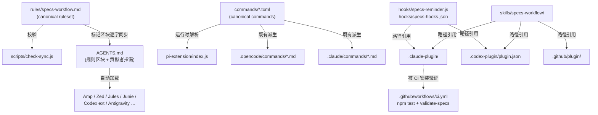

# Design Document

## Overview

本模块为 specs-workflow 增加"插件层 + 运行时层"适配并补齐指令层的 AGENTS.md 形态，使 skill 分发从"仅指令层"升级为 ponytail 同款三层架构。核心原则沿用仓库既有约定：**canonical 单一事实源 + thin adapter**——所有新增适配文件只引用 `rules/specs-workflow.md`、`commands/*.toml`、`skills/specs-workflow/`，不复制正文；所有派生文本纳入 `check-sync.js` 校验范围。

## Architecture

新增/变更文件与数据流（虚线为"引用/校验"关系，实线为"内容来源"）：



分层覆盖结果：

| 层级 | 载体 | 覆盖 host |
|------|------|-----------|
| instruction | AGENTS.md（新增）、既有 7 个 rule adapter | Amp、Zed、Jules、Junie、Codex 扩展、Antigravity、CodeWhale、Copilot CLI fallback + 原 Cursor/Windsurf/Cline/Kiro/Qoder/Copilot |
| plugin | `.claude-plugin/`、`.codex-plugin/`、`.github/plugin/` | Claude Code、Codex、Copilot CLI（一条命令安装，命令+skill+hooks 全量生效） |
| runtime | `hooks/specs-hooks.json` + 提醒脚本、pi 扩展 | 会话/subagent 启动注入提醒（不依赖 agent 回忆） |

## Components

### 1. AGENTS.md 标记区块（任务 1.1）

- 在根 `AGENTS.md` 现有内容之后追加：

  ```text
  <!-- specs-workflow:ruleset:start -->
  （rules/specs-workflow.md 主体，逐字）
  <!-- specs-workflow:ruleset:end -->
  ```

- 贡献者指南在前（服务本仓库开发），规则区块在后（服务分发与 dogfooding）。
- 脚本实现时规则文件保持无 frontmatter，直接 `read()` 全文比对。

### 2. check-sync.js 扩展（任务 1.2）

- 新增校验项：用正则提取 `AGENTS.md` 中 `<!-- specs-workflow:ruleset:start -->` 与 `:end` 之间的文本，`trim` 后与 `rules/specs-workflow.md` 主体比对；区块缺失同样报错。
- 保持既有输出风格（`check(ok, msg)` + 非零退出码）。

### 3. 插件 manifests（任务 2.1–2.3）

- `.claude-plugin/plugin.json`：`name`/`description`/`version`/`author` + `hooks` 指向 `hooks/specs-hooks.json`（Phase 3 完成前可先省略该字段，3.2 接入）。命令与 skill 依赖 host 自动发现 `commands/`、`skills/`；若实现时发现与根 `commands/`（Gemini TOML）冲突，按 Decision 2 处理。
- `.claude-plugin/marketplace.json`：`marketplace` 数组，name 指向本插件。
- `.codex-plugin/plugin.json`：`skills: "./skills/"`、`hooks: "./hooks/specs-hooks.json"`。
- `.github/plugin/plugin.json` + `marketplace.json`：Copilot CLI marketplace 结构。
- 各 manifest 字段以实现时对应 host 的官方插件文档为准；与本文档冲突时以 host 文档为准并记入 CHANGELOG。

### 4. hooks（任务 3.1–3.2）

- `hooks/specs-reminder.js`（零依赖 node）：
  1. 读 stdin JSON，取 `cwd`；
  2. 若 `<cwd>/.agents/specs/index.md` 存在，输出 ≤10 行提醒（先读 index.md → 按需加载模块文档 → 实现后同步状态表/进度）；
  3. 全文 try/catch，始终 `exit 0`，无 `.agents/specs/` 时输出为空。
- `hooks/specs-hooks.json`：SessionStart（matcher 省略 = 全部）+ SubagentStart，均调用上述脚本；文件名刻意避开根 `hooks/hooks.json`（见 Decision 3）。

### 5. pi 扩展（任务 4.1–4.3）

- `pi-extension/index.js`：导出 pi 扩展，`session_start` 事件中按第 4 节同条件注入提醒；注册 5 个 `/specs*` 命令。
- 提示词来源：运行时用内置迷你解析器读取 `commands/*.toml` 的 `prompt` 字段（复用 check-sync 的 `parseToml` 思路，三引号优先），`{{args}}` 透传给命令参数。
- `pi-extension/package.json`：声明扩展入口，支持 `pi install`（本地路径与 git 两种来源验证）。

### 6. CI 工作流（任务 5.1）

- `.github/workflows/ci.yml`：push/PR → `node scripts/check-sync.js`；模块自检阶段加跑 `node scripts/validate-specs.js .`。

## Key Decisions

### Decision 1: AGENTS.md 采用"标记区块"而非整体替换

**Context:** 根 `AGENTS.md` 既有内容是本仓库的贡献者指南，不能整体替换成 spec 规则集；但 ponytail 证明了"AGENTS.md 即规则集"可以零成本覆盖十余个 host。

**Options Considered:**
- **Option A: 整体替换 AGENTS.md 为规则集** — Pros: 与 ponytail 完全一致 / Cons: 丢失贡献者指南，仓库开发自身受影响
- **Option B: 单独提供可复制片段文档（如 docs/agents-snippet.md）** — Pros: 零冲突 / Cons: checkout 自动加载失效，等于没有扩容
- **Option C: 标记区块追加** — Pros: 两类内容共存，checkout 自动加载生效，可被脚本校验 / Cons: 需在 check-sync 中增加提取逻辑（约 10 行）

**Decision:** Option C。

**Rationale:** 同时满足"分发"与"仓库自身开发"两个场景；标记区块让一致性校验成为可能，弥补与 ponytail 方案相比唯一的复杂度差异。

### Decision 2: manifest 组件路径显式声明，避免根 `commands/` 目录歧义

**Context:** 仓库根 `commands/` 存放 Gemini TOML，而 Claude Code 插件按约定自动发现 `commands/*.md`，同目录混用两种格式有歧义风险。

**Options Considered:**
- **Option A: 依赖 host 自动发现根目录** — Pros: 零配置 / Cons: TOML 与 MD 混居，行为依赖 host glob 细节
- **Option B: manifest 显式声明组件路径（如 commands 指向 `.claude/commands`）** — Pros: 行为确定、与既有派生链一致 / Cons: 需逐 host 核对 manifest 字段是否支持
- **Option C: 为插件新建 `plugin-commands/` 复制一份** — Pros: 简单 / Cons: 违反 thin adapter，产生新的漂移面

**Decision:** Option B；若某 host manifest 不支持自定义路径，则回退 Option A 并在 CHANGELOG 记录。

**Rationale:** 显式声明让插件直接复用既有 canonical 派生文件，不新增复制物；字段支持情况在实现时对照 host 官方文档确认。

### Decision 3: hooks 共用文件命名为 `hooks/specs-hooks.json`

**Context:** ponytail 刻意不占用根 `hooks/hooks.json`，因为 Gemini CLI 会自动加载该路径而其 hook 事件名不同；本仓库未来可能补 Gemini 扩展。

**Options Considered:**
- **Option A: 根 `hooks/hooks.json`** — Pros: Claude 自动发现 / Cons: 未来 Gemini 扩展会误加载
- **Option B: `hooks/specs-hooks.json`，由各 manifest 显式引用** — Pros: 与 ponytail 同理，规避隐式加载 / Cons: Claude manifest 需多一个字段

**Decision:** Option B。

**Rationale:** 显式引用成本极低，且为未来 Gemini/Antigravity 扩展保留路径空间。

### Decision 4: pi 扩展运行时解析 TOML，而非生成 JS 常量

**Context:** 命令提示词的 canonical 源是 `commands/*.toml`；pi 扩展需要同样的提示词。

**Options Considered:**
- **Option A: 运行时解析 TOML** — Pros: 单一事实源，TOML 更新即时生效 / Cons: 需内置 ~20 行迷你解析器（无依赖约束）
- **Option B: 构建/脚本生成 JS 常量** — Pros: 运行时简单 / Cons: 增加生成步骤与漂移面，违背 thin adapter

**Decision:** Option A。

**Rationale:** 解析器极小且已有 `parseToml` 参考实现；换来的是零漂移面。

### Decision 5: MCP server 缓期（不在本模块范围）

**Context:** ponytail 另有 `ponytail-mcp/` 服务 MCP-only host。

**Options Considered:**
- **Option A: 本模块一并实现 MCP server** — Pros: 对齐面更全 / Cons: 目标 host（Claude Code、Codex、Copilot CLI、pi、AGENTS.md 系）均已有 plugin/instruction 通道，MCP 是低频兜底
- **Option B: 缓期，仅在文档记录为后续可选** — Pros: 控制模块规模 / Cons: MCP-only host 暂无覆盖

**Decision:** Option B。

**Rationale:** 收益/成本比过低；待有真实 MCP-only host 需求再立项（可复用 Decision 4 的 TOML 解析思路）。

## Error Handling

| Scenario | Handling |
|----------|----------|
| hook 脚本读 stdin 失败 / JSON 解析失败 | 捕获后静默退出 0，不输出任何内容 |
| `.agents/specs/index.md` 不存在 | 输出为空（插件静默，不干扰非 specs 项目） |
| AGENTS.md 缺少标记区块或区块被改坏 | `check-sync.js` 报错并以非零码退出，CI 拦截 |
| pi 扩展解析 TOML 失败 | 命令注册跳过该项并 `console.error` 提示，不中断扩展加载 |
| 插件 manifest 字段与 host 实际 schema 不符 | 以 host 官方文档为准修正，差异记入 CHANGELOG |
| CI 中 validate-specs 失败 | CI 失败，按报错修复 specs 文档结构 |

## Correctness Properties

*A property is a formal statement about what the system should do.*

### Property 1: 规则集单一事实源

*For any* 分发的规则正文副本（AGENTS.md 标记区块、既有 7 个 rule adapter），*该副本主体与* `rules/specs-workflow.md` 主体逐字一致，*且* `check-sync.js` 对其中每一项都有对应校验。

**Validates: Requirements 1.1, 1.2**

### Property 2: 薄适配（零正文复制）

*For any* 新增插件 manifest 或 pi 扩展，*其中不包含任何规则正文或命令提示词正文，只包含对 canonical 文件的路径引用或运行时读取。*

**Validates: Requirements 2.5, 4.4**

### Property 3: hook 无害性

*For any* hook 执行输入，*IF* cwd 无 `.agents/specs/index.md` *或脚本遇到任何异常，THEN* 输出为空且退出码为 0。

**Validates: Requirements 3.2, 3.4**

### Property 4: 命令同源

*For any* 命令名（specs、specs-init、specs-requirements、specs-design、specs-tasks），*pi 扩展注册的提示词与* `commands/*.toml` 中对应 `prompt`（经 `{{args}}` 替换后）一致。

**Validates: Requirements 4.2, 4.4**

### Property 5: 漂移必被拦截

*For any* 派生文本发生漂移（rule copies、commands、AGENTS.md 区块任一），*WHEN* `npm test`（check-sync）运行，*THEN* 以非零码失败。

**Validates: Requirements 1.2, 5.1**
