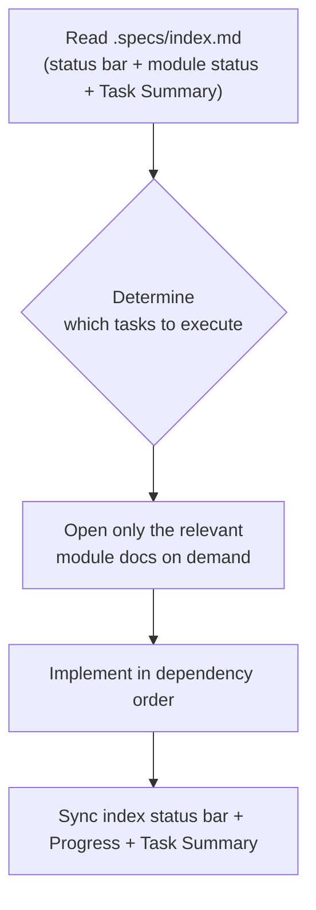

# Specs Workflow

This skill enforces a spec-driven, traceable workflow for AI coding tasks. Before code is written, each module gets a `requirements.md`, `design.md`, `tasks.md`, and `CHANGELOG.md` under `.specs/`, so the agent always knows what to build, why, and how it fits the bigger picture.

## Progressive Disclosure

`.specs/` uses the same progressive disclosure protocol as skills: the index is the lightweight layer that stays discoverable, and module documents are loaded only when the current task needs them.

| Layer | What | When loaded |
|-------|------|-------------|
| L1 · Index (resident) | `.specs/index.md` — status bar (next task / next gate) + module status table with Progress + Task Summary + dependencies/priority | Always, first — determines which module(s) and task(s) to execute |
| L2 · Module docs (on demand) | `<module>/requirements.md`, `design.md`, `tasks.md` | Only for modules the current task touches |
| L3 · Supporting docs (on demand) | `<module>/CHANGELOG.md`, referenced files | Only when design revisions or history are needed |



## When to Use This Skill

Use this skill when the user:

- Starts a new feature, module, or project and wants requirements, design, and task plans written down before implementation
- Continues work on a project that already has a `.specs/` directory and needs to follow its conventions
- Wants requirements, design decisions, and implementation tasks to stay traceable to each other
- Needs to decide module status, dependencies, or implementation order in `.specs/index.md`
- Needs to know which pending tasks exist across modules before picking the next one to work on, or wants a glanceable progress/status snapshot (done/total, next task, next gate)
- Finishes a module and needs to mark it as archived
- Redesigns a module without creating scattered version documents

## Workflow

### Step 1: Read the Index First (Progressive Disclosure)

Always read `.specs/index.md` first — it is the resident index. Read the status bar at the top to see the current module + status, done/blocked counts, and the derived **next task** and **next gate**; from the module status table (with `Progress`) and the Task Summary table, determine which module(s) the requested work belongs to and which tasks are pending. Then open only the relevant module documents (`tasks.md`, and `requirements.md` / `design.md` as needed) on demand — do not load every module's documents upfront. If `.specs/` does not exist, propose creating it before starting the task.

### Step 2: Create Module Documents Before Coding

Before writing any code for a new module or feature, create `.specs/<module>/` containing `requirements.md`, `design.md`, `tasks.md`, and `CHANGELOG.md`, and fill in the requirements. Add a row for the module in the `.specs/index.md` status table, and add a row per task in the `.specs/index.md` Task Summary table (as `tasks.md` is written). Use the skeletons in [references/file-templates.md](references/file-templates.md) for structure, the per-section prompting guidance in [references/prompt-templates.md](references/prompt-templates.md) for depth, the quality gates in [references/checklists.md](references/checklists.md) for acceptance, and the [references/examples/traceability.md](references/examples/traceability.md) example for the exact traceability format.

### Step 3: Write Requirements

Document what the system must do in `requirements.md`. Number each requirement as `Requirement N` (integer, incrementing per module), each with a user story and acceptance criteria numbered `N.M`. Write acceptance criteria in SHALL / WHEN / IF / WHILE form, plus composite `AND` / `OR` conditions and state-based, performance, and security variants, so they are testable.

### Step 4: Write the Design

Document how the system is built in `design.md`: architecture, data flow, component interfaces, data models, error handling, and the key decisions you made (context, options considered, chosen option, rationale). For every correctness guarantee, add a **Correctness Property** and mark it with `**Validates: Requirements x.y**` so the design maps back to the requirements.

### Step 5: Write the Task Plan

Break the implementation into hierarchical tasks numbered `N.M` (independent of requirement numbers) in `tasks.md`, sequenced by a stated strategy (Foundation-First / Feature-Slice / Risk-First / Hybrid). Every task references the requirements it implements with `_Requirements: x.y, x.z_`. Include a Task Dependency Graph (waves) and checkpoint tasks that run tests/builds at meaningful milestones — each phase's terminal task is that phase's **gate**. At the end of `tasks.md`, add a **Status Block** with the progress (`done/total`), the current task, and the gate chain (`<phase>.<last task> → …`).

### Step 6: Implement and Sync Progress

Execute tasks in dependency order. Check off completed tasks with `- [x]`, keep the `.specs/index.md` module status table up to date (move the module along `draft → design → implementing → implemented`), and sync the Task Summary table checkboxes in `.specs/index.md` to match `tasks.md`. Update the `Progress` column (`done/total (pct)`), the module's Status Block, and the index status bar: **next task** = the first todo task whose `Depends on` are all done; **next gate** = the next unchecked phase-terminal task in the gate chain. At each checkpoint, run the tests/build and report results.

### Step 7: Record Design Changes

When a design changes, append the change to `<module>/CHANGELOG.md` with the date, what changed, and the rationale. Never create `v1.md` / `v2.md` version files.

### Step 8: Mark Completed Modules as Archived

When a module is accepted and finished, set its status to `archived` in the `.specs/index.md` status table. The module directory stays in place; git history preserves the documents.

## Directory Structure

```
.specs/
├── index.md             # Global index: status bar + module status (with Progress) + task summary, dependencies/priority
└── <module>/
    ├── requirements.md  # Requirements (Requirement N + acceptance criteria)
    ├── design.md        # Design (architecture/data flow/interfaces + Correctness Properties)
    ├── tasks.md         # Tasks (reference requirement numbers + dependency graph + status block)
    └── CHANGELOG.md     # Change log (design revision records)
```

## Mandatory Rules

| # | Rule |
|---|------|
| 1 | Create the four `.specs/<module>/` files and fill in requirements before starting implementation; register the module and its tasks in `.specs/index.md` |
| 2 | Keep traceability: tasks reference `_Requirements: x.y_`; each Correctness Property marks `**Validates: Requirements x.y**` |
| 3 | Record design revisions in `CHANGELOG.md`; never create `v1.md`/`v2.md` files |
| 4 | Shared facilities reused across modules get their own spec dir under `.specs/shared/` |
| 5 | Check off tasks `- [x]` and sync the `.specs/index.md` status and Task Summary tables, `Progress` column, index status bar, and module status blocks as you go |
| 6 | Mark accepted modules `archived` in the `.specs/index.md` status table |
| 7 | Read `.specs/index.md` before any module document; load module docs on demand based on the Task Summary |
| 8 | Derive next task / next gate from dependencies (first todo task with all deps done; next unchecked phase-terminal task) and record them in the index status bar |

## Naming Conventions

| Item | Convention |
|------|------------|
| Module directory | Lowercase `kebab-case` (e.g. `vue-tree-lib`, `shared`) |
| Status values | `draft` / `design` / `implementing` / `implemented` / `archived` |
| Requirement numbering | `Requirement N` (integer, incrementing per module); acceptance criteria use `N.M` sub-numbers |
| Task numbering | Hierarchical `N.M`, decoupled from requirement numbers |

## Prohibitions

- Do not write code for a module before its `.specs/<module>/` documents (at minimum `requirements.md`) exist and are filled in.
- Do not read every module's documents upfront; read `.specs/index.md` first and load only what the current task needs.
- Do not create versioned design files such as `v1.md` / `v2.md`; use `CHANGELOG.md` instead.
- Do not skip requirement references in tasks or `Validates` annotations in design properties.
- Do not leave completed tasks unchecked or out of sync with the `.specs/index.md` status and Task Summary tables.
- Do not let the index status bar, the `Progress` column, or a module's status block go stale relative to the task checkboxes.
- Do not duplicate shared infrastructure requirements across modules; extract them to `.specs/shared/`.

## When Unsure

- If the requested work spans multiple modules or its boundaries are unclear, ask the user how to scope it.
- If `.specs/` already exists, follow its existing conventions and status values rather than inventing new ones.
- If a module is already partially implemented, create documents retroactively for the next increment instead of reconstructing full history.
- If a design decision conflicts with an existing Correctness Property, update the design and CHANGELOG, then confirm with the user.
