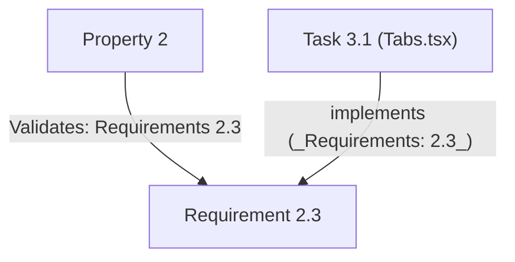

# Traceability Example

A condensed example showing how a requirement, a design property, and an implementation task stay traceable to each other. Each snippet below is complete — there are simply few of them. Use it as the format anchor for the `Validates:` / `_Requirements:` conventions described in [prompt-templates.md](../prompt-templates.md).

## 1. `requirements.md` — one requirement

```markdown
### Requirement 2: Component context and state management

**User Story:** As a library user, I want the Tabs component to manage the active state
automatically and support controlled and uncontrolled modes, so that I can use uncontrolled
mode for simple scenarios and controlled mode when integrating with routing or a state manager.

#### Acceptance Criteria

1. THE Tabs component SHALL inject a `TabsContext` into all descendant components via Vue
   `provide`, containing `activeTab`, `setActiveTab`, `orientation`, `activationMode`,
   `registerTab`, and `unregisterTab`.
2. WHEN the `defaultValue` prop is provided and `modelValue` is not, THEN THE Tabs component
   SHALL manage `activeTab` with internal reactive state initialized to `defaultValue`.
3. WHEN the `modelValue` prop is provided, THEN THE Tabs component SHALL treat `modelValue`
   as the controlled `activeTab` value and notify the parent via the `update:modelValue`
   event on activation change.
4. WHILE in controlled mode, THE Tabs component SHALL NOT maintain internal `activeTab`
   state and only respond to `modelValue` prop changes.
5. WHEN neither `defaultValue` nor `modelValue` is provided, THEN THE Tabs component SHALL
   use the `value` of the first non-disabled Tab as the default active value.
6. THE Tab component SHALL obtain `TabsContext` via `inject`, call `registerTab` on mount
   to register itself, and call `unregisterTab` on unmount.
```

## 2. `design.md` — one property validating that requirement

```markdown
### Property 2: In controlled mode, modelValue is reflected in activeTab

*For any* string `v`, mounting `<Tabs modelValue={v}>` should result in `activeTab === v`
in the injected context, regardless of any internal state.

**Validates: Requirements 2.3**
```

## 3. `tasks.md` — one task implementing that requirement

```markdown
- [ ] 3.1 Create src/components/Tabs.tsx
  - Accept the `modelValue`, `defaultValue`, `orientation`, and `activationMode` props
  - Distinguish controlled/uncontrolled mode via the `isControlled` computed property
  - Uncontrolled mode: use the `internalActive` ref initialized to `defaultValue`
  - Controlled mode: read `activeTab` directly from the `modelValue` prop
  - Implement `setActiveTab`: emit `update:modelValue` in controlled mode, update
    `internalActive` in uncontrolled mode
  - Inject the context via `provide(TABS_CONTEXT_KEY, context)`
  - _Requirements: 2.2, 2.3, 2.4, 2.5_
```

## The traceability chain



Each direction is verifiable: the task states which requirement clauses it implements (`_Requirements:`), and each design property states which requirement clauses it validates (`**Validates:**`). Every referenced `Requirement N.M` must exist in `requirements.md` — no dangling references.
