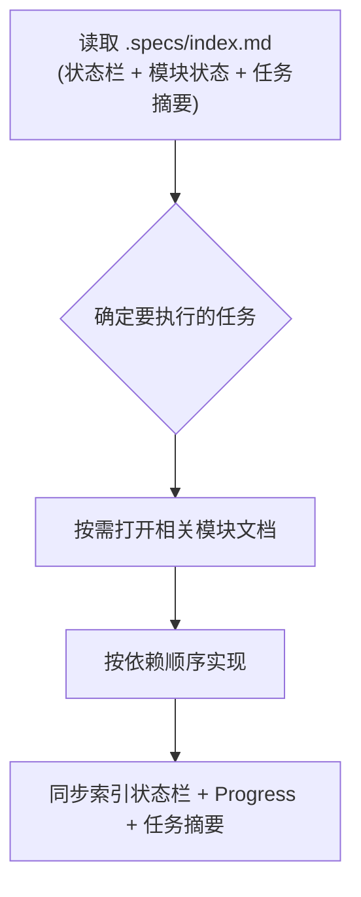

# 规范工作流（Specs Workflow）

本技能为 AI 编码任务强制推行"规范驱动、全程可追溯"的工作流。在写代码前，每个模块都需在 `.specs/` 下建立 `requirements.md`、`design.md`、`tasks.md` 和 `CHANGELOG.md`，让 AI 始终清楚要构建什么、为什么构建、以及它在整体中的位置。

## 渐进式披露（Progressive Disclosure）

`.specs/` 采用与 skills 相同的渐进式披露协议：索引是常驻的轻量层，模块文档只在当前任务需要时才被加载。

| 层 | 内容 | 何时读取 |
|----|------|---------|
| L1 · 索引（常驻） | `.specs/index.md` — 状态栏（下一任务 / 下一门禁）+ 含 Progress 的模块状态总表 + 任务摘要表 + 依赖/优先级 | 总是先读 —— 决定要执行哪些模块与任务 |
| L2 · 模块文档（按需） | `<module>/requirements.md`、`design.md`、`tasks.md` | 仅当当前任务涉及该模块时 |
| L3 · 支撑文档（按需） | `<module>/CHANGELOG.md`、被引用的文件 | 仅当需要设计改版或历史信息时 |



## 何时使用本技能

当出现以下情况时使用本技能：

- 用户开始一个新功能、新模块或新项目，希望先以文档形式记录需求、设计与任务计划，再进行实现
- 用户继续一个已存在 `.specs/` 目录的项目，需要遵循其约定
- 用户希望需求、设计决策与实现任务之间保持可追溯性
- 用户需要在 `.specs/index.md` 中确定模块状态、依赖关系或实现顺序
- 用户需要了解各模块有哪些待办任务，再决定下一步做哪个，或想一眼看到进度/状态快照（done/total、下一任务、下一门禁）
- 用户完成一个模块，需要将其标记为已归档
- 用户需要改版设计，但不希望产生零散的版本文档

## 工作流

### 第 1 步：先读索引（渐进式披露）

总是先读 `.specs/index.md` —— 它是常驻索引。先看顶部的状态栏，获取当前模块 + 状态、done/blocked 计数以及推导出的**下一任务**与**下一门禁**；再根据含 `Progress` 的模块状态总表与任务摘要表，判断本次工作属于哪些模块、哪些任务待执行。然后只按需打开相关模块文档（`tasks.md`，必要时再读 `requirements.md` / `design.md`），不要一次性读遍所有模块文档。若 `.specs/` 不存在，应在开始任务前提议创建它。

### 第 2 步：写代码前先创建模块文档

在为新模块或新功能编写任何代码之前，先创建 `.specs/<module>/` 目录，包含 `requirements.md`、`design.md`、`tasks.md`、`CHANGELOG.md` 四个文件，并填好需求。在 `.specs/index.md` 状态总表中为该模块新增一行，并在任务摘要表中为每个任务新增一行（随 `tasks.md` 编写）。骨架模板见 [references/file-templates.md](../skills/specs-workflow/references/file-templates.md)（定结构）；逐节思考提示见 [references/prompt-templates.md](../skills/specs-workflow/references/prompt-templates.md)（定深度）；质量验收清单见 [references/checklists.md](../skills/specs-workflow/references/checklists.md)（定合格标准）；精确的追溯格式见 [references/examples/traceability.md](../skills/specs-workflow/references/examples/traceability.md)（示例）。

### 第 3 步：编写需求

在 `requirements.md` 中记录系统必须做到什么。每条需求编号为 `Requirement N`（整数，模块内递增），包含用户故事（User Story）与验收标准，验收标准使用 `N.M` 子编号。验收标准采用 SHALL / WHEN / IF / WHILE 句式书写，可补充复合 `AND` / `OR` 条件以及基于状态、性能与安全类的变体，以便可测试。

### 第 4 步：编写设计

在 `design.md` 中记录系统如何构建：架构、数据流、组件接口、数据模型、错误处理，以及你做过的关键决策（上下文、备选方案、选定方案、理由）。对每一条正确性保证，添加一条 **Correctness Property**，并标注 `**Validates: Requirements x.y**`，使设计回指到需求。

### 第 5 步：编写任务计划

在 `tasks.md` 中将实现拆分为层级编号的任务（`N.M`，与需求编号解耦），并按选定的排序策略组织（Foundation-First / Feature-Slice / Risk-First / Hybrid）。每条任务用 `_Requirements: x.y, x.z_` 引用其实现的需求条款。包含任务依赖图（waves）与检查点（checkpoint）任务，在关键里程碑运行测试/构建 —— 每个阶段的终态任务即该阶段的**门禁**。任务状态只维护在 `.specs/index.md` 中，不在 `tasks.md` 添加手工维护的状态块。

### 第 6 步：实现并同步进度

按依赖顺序执行任务。完成的任务勾选 `- [x]`，及时更新 `.specs/index.md` 模块状态总表（按 `draft → design → implementing → implemented` 推进），并同步 `.specs/index.md` 任务摘要表中的勾选状态与 `tasks.md` 保持一致。同步更新 `Progress` 列（`done/total (pct)`）与索引状态栏：**下一任务** = 第一个状态为 `[ ]` 且其 `Depends on` 全部已完成的任务；**下一门禁** = 门禁链中下一个尚未勾选的阶段终态任务。在每个检查点运行测试/构建并汇报结果。

### 第 7 步：记录设计变更

设计发生变更时，将变更追加到 `<module>/CHANGELOG.md`，记录日期、变更内容与设计取舍/原因。严禁创建 `v1.md` / `v2.md` 等版本文件。

### 第 8 步：将已完结模块标记为已归档

模块验收完结后，在 `.specs/index.md` 状态总表中将其状态改为 `archived`。模块目录保留原位，文档由 git 历史保存。

## 目录结构

```
.specs/
├── index.md             # 全局索引：状态栏 + 含 Progress 的模块状态总表 + 任务摘要表 + 依赖/优先级
└── <module>/
    ├── requirements.md  # 需求（Requirement N + 验收标准）
    ├── design.md        # 设计（架构/数据流/接口 + Correctness Properties）
    ├── tasks.md         # 任务（引用需求编号 + 依赖图）
    └── CHANGELOG.md     # 变更日志（设计改版记录）
```

## 强制规则

| # | 规则 |
|---|------|
| 1 | 动工前先创建 `.specs/<module>/` 四个文件并填好需求，再开始实现；并在 `.specs/index.md` 中登记模块及其任务 |
| 2 | 保持可追溯：任务引用 `_Requirements: x.y_`；每条 Correctness Property 标注 `**Validates: Requirements x.y**` |
| 3 | 设计改版记录到 `CHANGELOG.md`；严禁创建 `v1.md`/`v2.md` 文件 |
| 4 | 跨模块复用的共享设施单独建目录 `.specs/shared/` |
| 5 | 完成的任务勾选 `- [x]`，并同步 `.specs/index.md` 状态总表、任务摘要表、`Progress` 列与索引状态栏 |
| 6 | 验收完结的模块在 `.specs/index.md` 状态总表中标记为 `archived` |
| 7 | 读任何模块文档前，先读 `.specs/index.md`；根据任务摘要表按需加载模块文档 |
| 8 | 从依赖推导下一任务 / 下一门禁（第一个依赖全部满足的待办任务；门禁链中下一个未勾选的阶段终态任务），并记录在索引状态栏中 |

## 命名约定

| 项目 | 约定 |
|------|------|
| 模块目录 | 小写 `kebab-case`（如 `vue-tree-lib`、`shared`） |
| 状态取值 | `draft` / `design` / `implementing` / `implemented` / `archived` |
| 需求编号 | `Requirement N`（整数，模块内递增）；验收标准使用 `N.M` 子编号 |
| 任务编号 | 层级 `N.M`，与需求编号解耦 |

## Prohibitions

- 不得在模块的 `.specs/<module>/` 文档（至少是 `requirements.md`）创建并填写完成之前编写代码。
- 不得一次性读遍所有模块文档；应先读 `.specs/index.md`，只加载当前任务需要的文档。
- 不得创建 `v1.md` / `v2.md` 等版本化设计文件；应使用 `CHANGELOG.md`。
- 不得在任务中跳过需求引用，或在设计属性中跳过 `Validates` 标注。
- 不得让已完成的任务保持未勾选，或与 `.specs/index.md` 状态总表、任务摘要表脱节。
- 不得让索引状态栏或 `Progress` 列与任务勾选状态脱节。
- 不得在各模块中重复编写共享基础设施的需求；应抽取到 `.specs/shared/`。

## 不确定时

- 若请求的工作跨越多个模块或边界不清晰，向用户询问如何划分范围。
- 若 `.specs/` 已存在，遵循其既有约定与状态取值，而不是发明新规则。
- 若模块已部分实现，为其下一个增量补建文档，而不是重建完整历史。
- 若设计决策与现有 Correctness Property 冲突，更新设计与 CHANGELOG 后，与用户确认。
